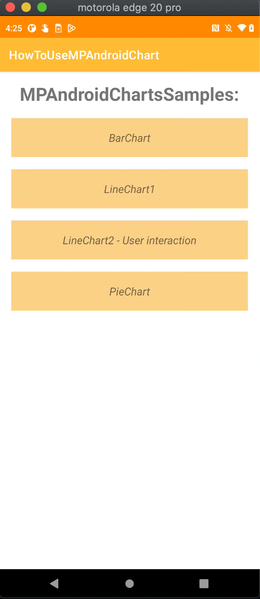
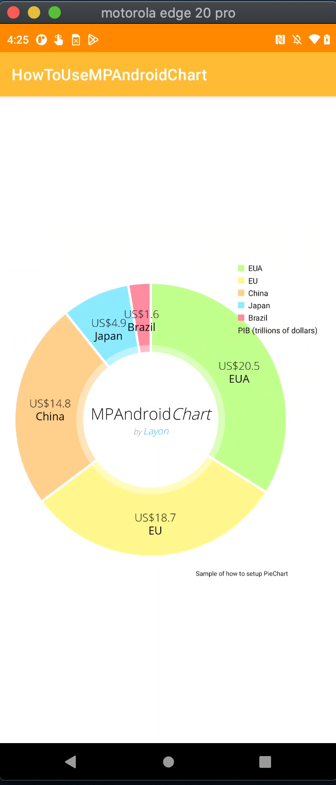
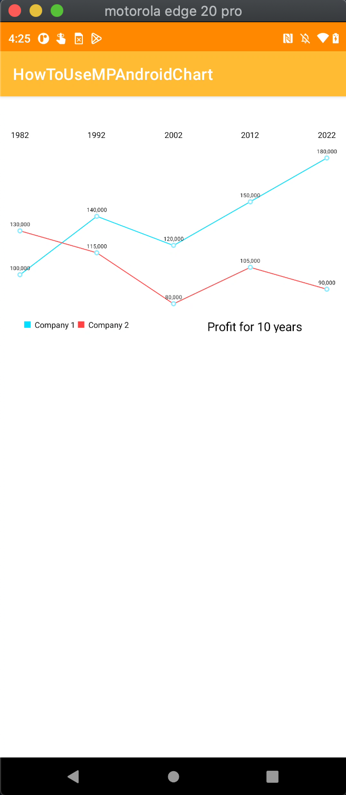
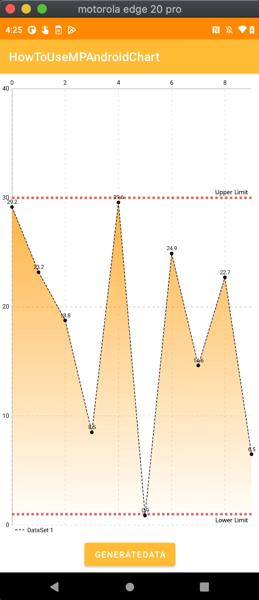
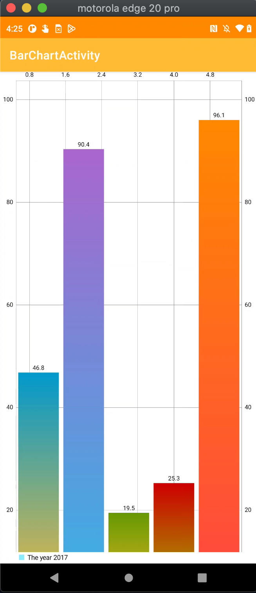

# MPAndroidChartSample
## Android app sample of how to use MPAndroidChart to create interactive charts

* MPAndroidChart
* BarChart
* LineChart
* PieChart
* User Interaction with Chart

    

## Reference
* https://github.com/PhilJay/MPAndroidChart
* https://medium.com/@codingInformer/how-to-use-mpandroidchart-in-android-studio-c01a8150720f
* https://weeklycoding.com/mpandroidchart/
* https://play.google.com/store/apps/details?id=com.xxmassdeveloper.mpchartexample